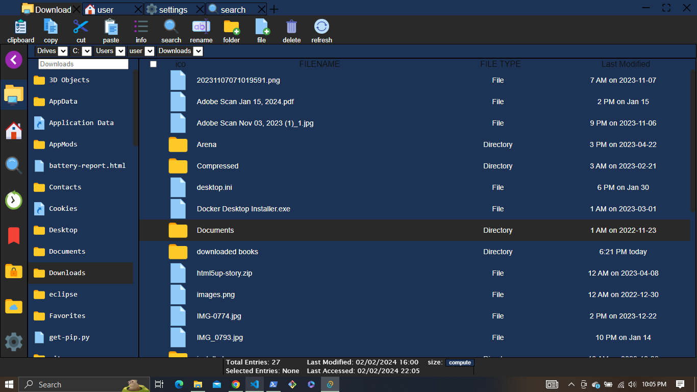

# pitou-app

[](https://opensource.org/licenses/Apache-2.0)

## Description

A cross-platform file explorer built with rust, html, css & tauri

## Stack
- tauri
- yew (components management)
- html (ui design)
- css (ui design)
- tokio (virtual thread manipulation)
- javascript (event listeners)
- wasm_bindgen, js_sys, wasm_bindgen_futures (web assembly <=> js)
- sqlite (data & cache storage)


## Installation

To build or run demo of this application, follow the following instructions:

```bash
# Clone the repository
git clone https://github.com/nisaacdz/pitou-app.git

# Change directory
cd pitou-app

# Run/Test the application
cargo tauri dev

# Build the application
cargo tauri build --release
```

## License
Apache 2.0

## Demo
[](https://drive.google.com/file/d/19HRFB6KMP-koXJyH88dHmLY-QOr4MeJy/view?usp=drive_link)
